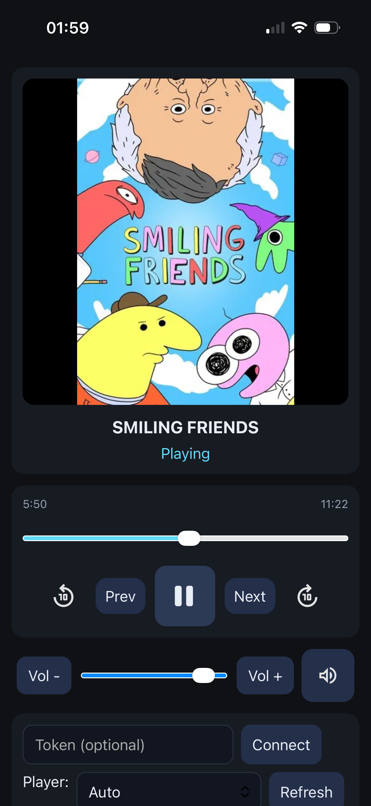

# remoted

Go daemon + web UI for remote media control on Linux (MPRIS playback + PipeWire/PulseAudio volume). Includes a live now-playing page with artwork, transport controls, seek bar, and volume.
<div align="center">
  
</div>
## Features
- Auto player selection with manual override; WebSocket push updates (no polling).
- Play/pause, next/prev, ±10s seek, arbitrary seek via scrubber, volume set/delta/mute.
- Artwork proxying for local `file://` art (under `/tmp`/`/var/tmp`). Optional Chromium helper extension can send the active tab URL to remoted for higher-quality art (YouTube thumbnails, TMDb lookups); Firefox already exposes URLs via MPRIS.
- HTTP API + browser UI (`/ui`).
- Progressive Web App enabled for mobile interfaces. Can now "add to homescreen" on iOS for easy and native-feeling access.

## Prereqs
- Linux desktop with MPRIS-capable players and DBus (standard on most distros).
- PipeWire (`wpctl`) or PulseAudio (`pactl`) for volume control.
- Go 1.21+ (only needed for `go install` or building yourself).

## Install (Go users)
```bash
go install github.com/ozdotdotdot/UMR/cmd/remoted@latest
```
Notes:
- Binary name: `remoted`; ensure `$GOBIN` (or `$GOPATH/bin`) is on your `PATH`.
- `@latest` resolves to the latest git tag (e.g., `v0.1.0`). Tag and push releases so users get a stable version.

## Install (downloaded binary)
Release tarballs include ready-to-run binaries:
- `remoted-linux-amd64.tar.gz`
- `remoted-linux-arm64.tar.gz`

Download and unpack:
```bash
tar -xf remoted-linux-amd64.tar.gz
./remoted-linux-amd64
```

## Configure / Run
You can configure with env vars or flags (flags override env defaults):
- `REMOTED_BIND` / `-bind` — listen address (default `127.0.0.1`)
- `REMOTED_PORT` / `-port` — listen port (default `8080`)
- `REMOTED_TOKEN` / `-token` — bearer token (required for everything except `/healthz` when set)
- `REMOTED_ART_CACHE` / `-art-cache` — art cache dir (default `~/.cache/umr/art` or `/tmp/umr/art`)
- `REMOTED_TMDB_KEY` / `-tmdb-key` — optional TMDb API key; enables fallback art for HBO/Max titles
- `-version` (string) or `-v` (print version and exit)

Examples:
```bash
# local-only (env)
REMOTED_TOKEN="choose-a-secret" remoted

# LAN access (flag)
remoted -bind=0.0.0.0 -token=choose-a-secret
```

Visit the UI at `http://<host>:<port>/ui` (enter your token if set). WebSocket updates keep the page live; transport and volume controls call the API.

Health check:
```bash
curl http://127.0.0.1:8080/healthz
```

## Optional add-ons
- Chromium URL helper: Chromium doesn’t expose tab URLs over MPRIS. A tiny local extension can POST the active media tab URL to `http://127.0.0.1:8080/player/url` (with your token) so YouTube thumbnails and TMDb lookups work in Chromium. Load the helper as an unpacked extension (Developer Mode in `chrome://extensions`); Firefox already exposes URLs and doesn’t need this.
- TMDb fallback art: set `REMOTED_TMDB_KEY` (or `-tmdb-key`) to enable TMDb lookups for HBO/Max sessions that lack artwork. Uses a quick search (prefers exact title match, else most popular TV/movie with a poster), cached ~12h, w342 poster size, 2s timeout. Requires a TMDb account and an API (free)

## API
See `docs/API.md` for endpoints, auth, and examples (players, nowplaying, playback controls, seek, volume, art proxy).
